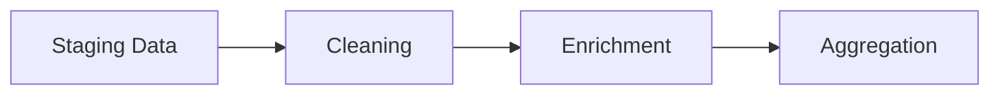

# Data Loading and Transformation Mechanics

## Data Loading Process

### 1. Web Scraping Mechanics

#### FDIC Data Collection
```python
def check_fdic_data():
    """
    1. Connects to FDIC website
    2. Checks for updates using BeautifulSoup
    3. Logs the check status
    4. Returns boolean indicating data freshness
    """
```

#### NCUA Data Collection
```python
def check_ncua_data():
    """
    1. Connects to NCUA website
    2. Checks for updates using BeautifulSoup
    3. Logs the check status
    4. Returns boolean indicating data freshness
    """
```

### 2. Data Validation Layer

#### Input Validation
- Data format verification
- Required field checks
- Data type validation
- Range validation for numeric fields

#### Business Rule Validation
- Asset tier boundaries
- Institution type classifications
- Geographic location validation
- Regulatory compliance checks

### 3. Error Handling

#### Retry Logic
```python
default_args = {
    'retries': 1,
    'retry_delay': timedelta(minutes=5),
    'email_on_failure': True
}
```

#### Error Categories
1. Connection Errors
   - Network timeouts
   - SSL verification failures
   - DNS resolution issues

2. Data Format Errors
   - Invalid JSON/XML
   - Missing required fields
   - Incorrect data types

3. Business Logic Errors
   - Invalid calculations
   - Rule violations
   - Constraint failures

## Data Transformation Pipeline

### 1. ETL Process Flow

#### Extract Phase


#### Transform Phase


#### Load Phase


### 2. Data Cleaning Operations

#### Text Data
- Whitespace normalization
- Case standardization
- Special character handling
- Format standardization

#### Numeric Data
- Unit conversion
- Decimal standardization
- Currency normalization
- Range validation

#### Date/Time Data
- Format standardization
- Timezone handling
- Date validation
- Period calculations

### 3. Data Enrichment

#### Asset Tier Classification
```sql
SELECT 
    institution_id,
    CASE 
        WHEN assets >= 10000000000 THEN '>$10B'
        WHEN assets >= 1000000000 THEN '$1B-$10B'
        WHEN assets >= 100000000 THEN '$100M-$1B'
        ELSE '<$100M'
    END as asset_tier
FROM financial_institutions;
```

#### Geographic Enrichment
```sql
SELECT 
    fi.*,
    r.region_name,
    r.economic_zone
FROM 
    financial_institutions fi
JOIN 
    regions r ON fi.state = r.state_code;
```

### 4. Data Aggregation

#### Time-based Aggregation
```sql
SELECT 
    institution_id,
    date_trunc('quarter', report_date) as quarter,
    AVG(total_assets) as avg_assets,
    SUM(total_deposits) as total_deposits
FROM 
    quarterly_stats
GROUP BY 
    institution_id,
    date_trunc('quarter', report_date);
```

#### Geographic Aggregation
```sql
SELECT 
    state,
    asset_tier,
    COUNT(*) as institution_count,
    SUM(total_assets) as total_assets
FROM 
    financial_institutions
GROUP BY 
    state,
    asset_tier;
```

## Performance Optimization

### 1. Database Optimization

#### Indexing Strategy
```sql
-- Primary lookup index
CREATE INDEX idx_institution_id ON financial_institutions(institution_id);

-- Composite index for common queries
CREATE INDEX idx_state_assets ON financial_institutions(state, total_assets);

-- Date range queries
CREATE INDEX idx_report_date ON quarterly_stats(report_date);
```

#### Partitioning Strategy
```sql
-- Partition by quarter for historical data
CREATE TABLE quarterly_stats (
    id SERIAL,
    report_date DATE,
    -- other columns
) PARTITION BY RANGE (report_date);

-- Create partitions
CREATE TABLE quarterly_stats_2024q1 
    PARTITION OF quarterly_stats 
    FOR VALUES FROM ('2024-01-01') TO ('2024-04-01');
```

### 2. Query Optimization

#### Materialized Views
```sql
CREATE MATERIALIZED VIEW mv_institution_summary AS
SELECT 
    state,
    asset_tier,
    COUNT(*) as institution_count,
    SUM(total_assets) as total_assets
FROM 
    financial_institutions
GROUP BY 
    state,
    asset_tier;

-- Refresh schedule
REFRESH MATERIALIZED VIEW mv_institution_summary;
```

#### Query Tuning
- Use of EXPLAIN ANALYZE
- Proper JOIN order
- Subquery optimization
- Appropriate WHERE clause ordering

## Monitoring and Maintenance

### 1. Performance Monitoring

#### Key Metrics
- Load time per source
- Transformation duration
- Query response times
- Resource utilization

#### Logging Strategy
```python
logging.basicConfig(level=logging.INFO)
logger = logging.getLogger(__name__)

def log_performance(operation, start_time):
    duration = time.time() - start_time
    logger.info(f"{operation} completed in {duration:.2f} seconds")
```

### 2. Data Quality Monitoring

#### Quality Checks
```sql
-- Completeness check
SELECT 
    COUNT(*) as total_records,
    COUNT(asset_tier) as records_with_asset_tier,
    COUNT(state) as records_with_state
FROM 
    financial_institutions;

-- Consistency check
SELECT 
    asset_tier,
    MIN(total_assets) as min_assets,
    MAX(total_assets) as max_assets
FROM 
    financial_institutions
GROUP BY 
    asset_tier;
```

#### Alert Thresholds
- Data volume deviations
- Error rate thresholds
- Performance degradation
- Data quality metrics 